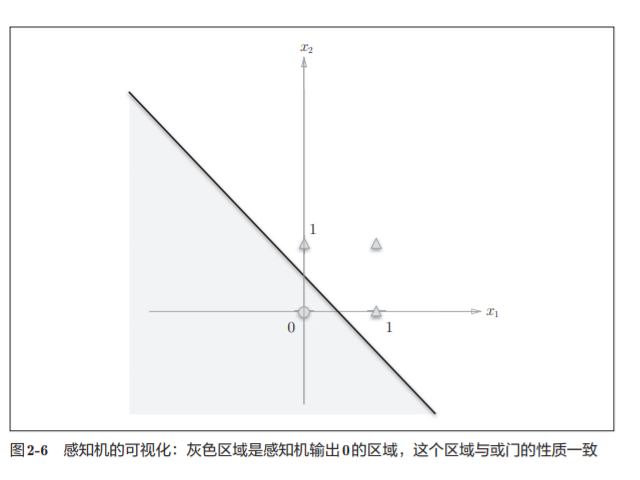
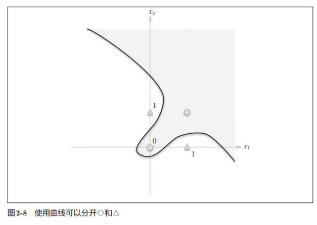

# 感知机的局限性

之前我们使用感知机实现了与门，与非门，或门三种逻辑电路，现在来考虑下异或门(XOR gate)。

## 异或门

异或门是两个输入中有一个为 1，输入为 1，否则为 0 的逻辑电路。
 
异或门真值表如下：

异或门真值表

| $x_{1}$ | $x_{2}$ | $y$ |
| :----:  | :----: | :----: |
| 0 | 0 | 0 |
| 1 | 0 | 1 |
| 0 | 1 | 1 |
| 1 | 1 | 0 |

很遗憾，用感知机是无法实现异或门的。为什么呢？
 
首先，我们先给出或门的一种表达式：
$$
y  =
\begin{cases}
0   & \text{ $ -0.5+x_{1} + x_{2}\leq 0 $} \\
1   & \text{ $ -0.5+ x_{1} + x_{2}>0$ }
\end{cases}
$$
直线 $-0.5+x_{1} + x_{2}=0$，将二维空间分割成两块，一块输出 1，一块输出 0。如下图所示，图来自于原书。
 

当 $(x_{1},x_{2}) = (0,0)$ 时或门输出 0；当 $(x_{1},x_{2}) = (0,1),(1,0),(1,1)$ 时输出为 1。
 
如果想实现或门，将图中 $\Delta$(1) 和 O(0) 分开即可。这条直线就将其分开了。实际上，任何能分开 $\Delta$ 和 O 的直线的参数都可以作为或门的感知机参数。

换成异或门呢，图像如下，图来自于原书：
 

如果把这其中一个 $\Delta$ 换成 O，我将绝杀，可惜换不得。
 
所以，我们使用任何一条直线都不能将 $\Delta$ 和 O 分开。

## 线性与非线性
之前说到，我们使用任何一条直线都不能分割上图，也就是不存在任何偏置和权重系数构成可以区分异或门的感知机。
 
但是，如果不是直线呢？
 
图像如下，图来自于原书：

发现没，直线不行，曲线可以啊。
 
所以啊，这就是感知机的局限了，它只能表示由一条直线分割的空间。对于曲线它就无能为力了。
 

由上图的曲线，我们可以引出线性空间和非线性空间的概念。姑且可以简单地认为，线性空间是由直线分割的空间，非线性空间是由曲线分割的。
 
这里可以参考百度百科对[线性空间](https://baike.baidu.com/item/%E5%90%91%E9%87%8F%E7%A9%BA%E9%97%B4/5936597?fromtitle=%E7%BA%BF%E6%80%A7%E7%A9%BA%E9%97%B4&fromid=9736703)的介绍。

具体内容就不展开说了。
