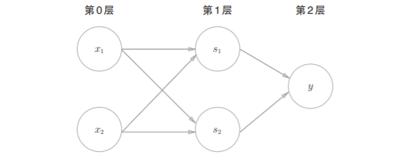

# 多层感知机

使用直线感知机无法实现异或门，换成曲线可以，但是感知机又不能感知曲线，那咋办呢？

好办，用多个感知机就可以了。

## 已有门电路的组合

我们可以借用感知机已经实现的逻辑电路通过组合来实现异或门。

可以使用的门电路有与门，与非门，或门。通过组合我们可以实现异或门。
<br>
门电路符号，仿佛回到了模电，数电课......
<br>

<center>与门，与非门，或门的符号</center>
<br>
如果你想“刨根问底”，可以从 PN 开始了解。
<br>
通过组合，实现异或门，图如下：


<center>组合电路实现异或门</center>
<br>
这又让我想起了模电，数电实验，通过简单的门电路我们可以实现器件，具体名字忘了，这些器件通过不同的接法，可以实现很多有趣的功能，上过这些课的应该知道。

现在，我们来确认一下上图的是否真正实现了异或门。
这里，把 $s_{1}$ 作为与非门的输出，把 $s_{2}$ 作为或门的输出，填入真值表中。
<center>异或门真值表</center>

| $x_{1}$ | $x_{2}$ | $x_{1}$ | $x_{2}$ | $y$ |
| :----:  | :----: | :----: |:----: | :----: |
| 0 | 0 | 1 | 0 | 0 |
| 1 | 0 | 1 | 1 | 1 |
| 0 | 1 | 1 | 1 | 1 |
| 1 | 1 | 0 | 1 | 0 |

## 异或门的实现

我们使用之前的 AND，NAND，OR函数来实现异或门。
```python
def XOR(x1, x2):
    s1 = NAND(x1, x2)
    s2 = OR(x1, x2)
    y = AND(s1, s2)
    return y

print("XOR(0,0) : " + str(XOR(0, 0)))
print("XOR(1,0) : " + str(XOR(1, 0)))
print("XOR(0,1) : " + str(XOR(0, 1)))
print("XOR(1,1) : " + str(XOR(1, 1)))
```
结果为：
```
XOR(0,0) : 0
XOR(1,0) : 1
XOR(0,1) : 1
XOR(1,1) : 0
```
异或门就完成了，接下来我们使用感知机(神经元)来表示它，如下图所示。


<center>用感知机表示异或门</center>
<br>
从上图中可以发现，异或门是一种有着多层神经元的神经网络，它有着两层感知机，因此也被称为多层感知机。
<br>
<br>
以下一段来自于原书：
<br>
上图中的感知机总共由3层构成，但是因为拥有权重的层实质上只有2层(第0层和第1层之间，第1层和第2层之间)，所以称为“2层感知机”。不过，有的文献认为上图中的感知机是由3层构成的，因而将其称为“3层感知机”。
<br>
<br>

在上图中，层与层之间的神经元进行信号的传送和接收。第0层的两个神经元接收输入信号，以一定的权重(此处为1)发送给第一层的神经元。第1层的两个神经元接收信号并以一定的权重(此处为1)发送给第二层的神经元。最后第二层神经元输出 $y$ 。

多层感知机机可以做到单层感知机无法做到的事，增加叠加层(加深层)，原本简单的感知机变得强大起来了。


