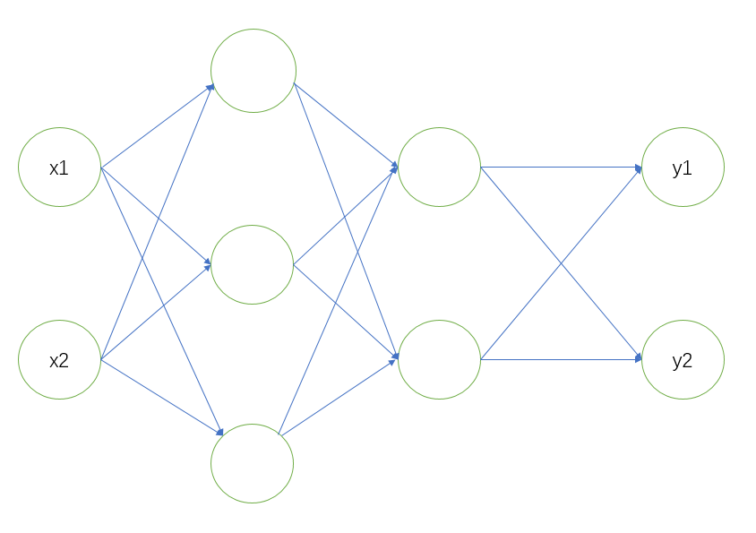
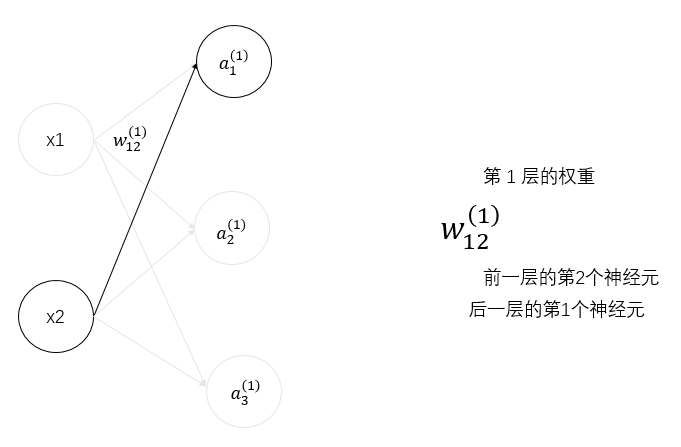
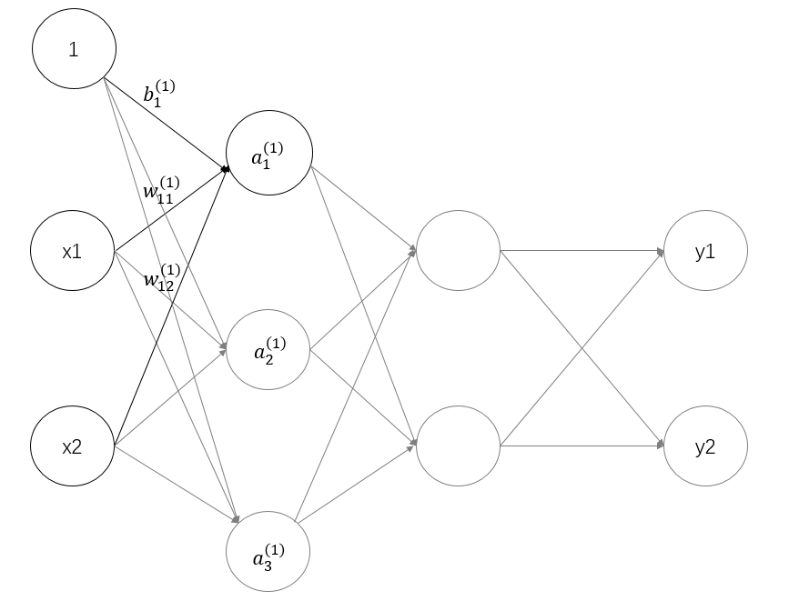
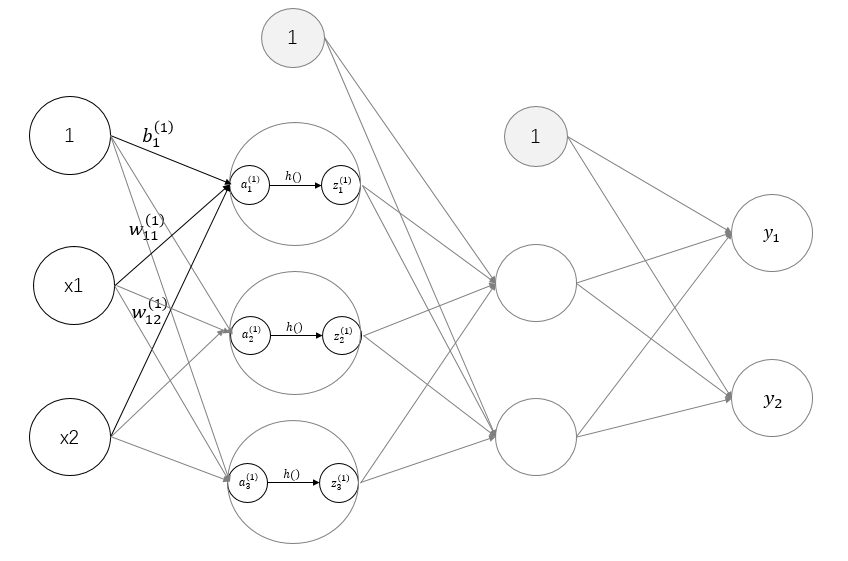
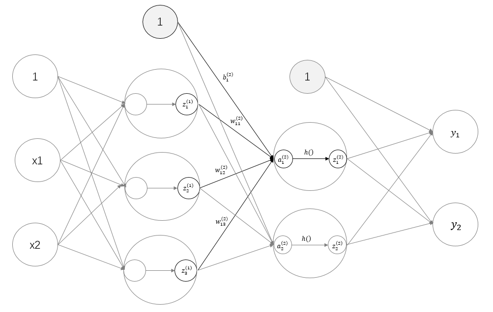
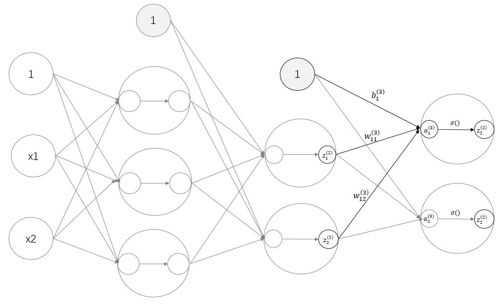

# 3 层神经网络的实现

现在我们使用 nunpy 数组来实现一个三层的神经网络。
<br>

<center>三层神经网络</center>

该网络的输入层(第0层)有2个神经元，隐藏层有两层，第1个隐藏层(第1层)有3个神经元，
第2个隐藏层(第2层)有2个神经元，输出层(第3层)有2个神经元。

## 符号确认
在本节，我们需要确定一些符号 $w_{12}^{(1)}$，$a_{1}^{(1)}$。
<br>

本节的重点是神经网络的运算可以视为矩阵运算。因为神经网络各层的运算是通过矩阵的相乘实现的(从宏观视角来考虑)。
<br>


下图只凸显了从输入层 $x_{2}$ 到后一层神经元 $a_{1}^{(1)}$ 的权重。


<center>权重</center>
<br>

权重和隐藏层的神经元的右上角有一个“(1)”，它表示权重和神经元的层号(即第1层的权重，第1层的神经元)。
<br>
此外，权重的右下角有两个数字，它们是后一层的神经元和前一层的神经元的索引号。
<br>
比如，$w_{12}^{(1)}$ 表示前一层的第2个神经元 $x_{2}$ 到后一层的第1个神经元 $a_{1}^{(1)}$ 的权重。
<br>
权重右下角按照“后一层的索引号，前一层的索引号”的顺序排列。

## 各层间信号传递的实现
现在来看一下从输入层到第1层的第1个神经元的信号传递过程，如下图所示。


<center>从输入层到第1层的信号传递</center>
<br>

图中增加了偏置神经元“1”。偏置的右下角的索引号只有一个，是因为前一层的偏置神经元(神经元“1”)只有一个。
<br>
现在我们用数学公式表示 $a_{1}^{(1)}$。$a_{1}^{(1)}$ 通过加权信号和偏置的和：
$$
a_{1}^{(1)}=w_{11}^{(1)}x_{1}+w_{12}^{(1)}x_{2}+b_{1}^{(1)}
$$

使用矩阵的乘法运算，可以将第1层的加权和如下表示：
$$
A^{(1)}=XW^{(1)}+B^{(1)}
$$
其中，
$$
A^{(1)}=(a_{1}^{(1)} \quad a_{2}^{(1)} \quad a_{3}^{(1)}),X=(x_{1} \quad x_{2}),B^{(1)}=(b_{1}^{(1)} \quad b_{2}^{(1)} \quad b_{3}^{(1)})
$$
$$
W^{(1)}=
\begin{pmatrix}
w_{11}^{(1)} \quad w_{21}^{(1)} \quad w_{31}^{(1)} \\
w_{12}^{(1)} \quad w_{22}^{(1)} \quad w_{32}^{(1)} \\
\end{pmatrix}
$$


观察第1层中激活函数的计算过程，用图表示如下。


<center>从输入层到第1层的信号传递</center>
<br>

如上图所示，隐藏层的加权和(加权信号和偏置的总和)用 $a$ 表示，被激活函数转换后的信号用 $z$ 表示。此外，图中 $h()$ 表示激活函数，这里我们使用的是sigmoid函数。用Python来实现，代码如下所示。
```python
import numpy as np

def sigmoid(x):
    return 1 / (1 + np.exp(-x))


X = np.array([1.0, 0.5])
W1 = np.array([[0.1, 0.3, 0.5], [0.2, 0.4, 0.6]])
B1 = np.array([0.1, 0.2, 0.3])
print(W1.shape)
# (2, 3)
print(X.shape)
# (2,)
print(B1.shape)
# (3,)
A1 = np.dot(X, W1) + B1
Z1 = sigmoid(A1)
print(A1)
# [0.3, 0.7, 1.1]
print(Z1)
# [0.57444252, 0.66818777, 0.75026011]
```

下面，我们来实现第1层到第2层的信号传递。如下图所示。


<center>第1层到第2层的信号传递</center>
承接上面的程序。

```python
W2 = np.array([[0.1, 0.4], [0.2, 0.5], [0.3, 0.6]])
B2 = np.array([0.1, 0.2])
print(Z1.shape) # (3,)
print(W2.shape) # (3, 2)
print(B2.shape) # (2,)
A2 = np.dot(Z1, W2) + B2
Z2 = sigmoid(A2)
```
除了第1层的输出(Z1)变成了第2层的输入这一点以外，其他的完全相同。通过使用 NumPy 数组，我们实现了层到层的信号传递过程。

最后是第2层到输出层的信号传递。如下图所示。


<center>从第2层到输出层的信号传递</center>
<br>

输出层的实现也和之前的实现基本相同。不过，激活函数和之前的隐藏层有所不同。
<br>
部分程序如下：
```python
def identity_function(x):
    return x

W3 = np.array([[0.1, 0.3], [0.2, 0.4]])
B3 = np.array([0.1, 0.2])
A3 = np.dot(Z2, W3) + B3
Y = identity_function(A3) # 或者Y = A3
```

这里我们定义了 identity_function() 函数(也称为“恒等函数”)，并将其作为输出层的激活函数。恒等函数会将输入按原样输出。上图中，输出层的激活函数用 $σ()$ 表示，隐藏层的激活函数则是 $h()$。

以下一段来自于原文：
<br>
输出层所用的激活函数，要根据求解问题的性质决定。一般地，回
归问题可以使用恒等函数，二元分类问题可以使用 sigmoid函数，
多元分类问题可以使用 softmax函数。关于输出层的激活函数，我们将在下一节详细介绍。

## 代码实现小结

至此，我们已经介绍完了3层神经网络的实现。现在我们把之前的代码实现全部整理一下。这里，我们按照神经网络的实现惯例，只把权重记为大写字母W1，其他的(偏置或中间结果等)都用小写字母表示。
```python
import numpy as np

def sigmoid(x):
    return 1 / (1 + np.exp(-x))

def identity_function(x):
    return x

def init_network():
    network = {}
    network['W1'] = np.array([[0.1, 0.3, 0.5], [0.2, 0.4, 0.6]])
    network['b1'] = np.array([0.1, 0.2, 0.3])
    network['W2'] = np.array([[0.1, 0.4], [0.2, 0.5], [0.3, 0.6]])
    network['b2'] = np.array([0.1, 0.2])
    network['W3'] = np.array([[0.1, 0.3], [0.2, 0.4]])
    network['b3'] = np.array([0.1, 0.2])
    return network

def forward(network, x):
    W1, W2, W3 = network['W1'], network['W2'], network['W3']
    b1, b2, b3 = network['b1'], network['b2'], network['b3']
    a1 = np.dot(x, W1) + b1
    z1 = sigmoid(a1)
    a2 = np.dot(z1, W2) + b2
    z2 = sigmoid(a2)
    a3 = np.dot(z2, W3) + b3
    y = identity_function(a3)
    return y


network = init_network()
x = np.array([1.0, 0.5])
y = forward(network, x)
print(y)
# [ 0.31682708 0.69627909]
```

这里定义了 init_network() 和 forward() 函数。
<br>
init_network() 函数会进行权重和偏置的初始化，并将它们保存在字典变量network中。这个字典变量network中保存了每一层所需的权重和偏置。
<br>
forward() 函数中则封装了将输入信号转换为输出信号的处理过程。
<br>
另外，这里出现了forward(前向)一词，它表示的是从输入到输出方向的传递处理。后面在进行神经网络的训练时，我们将介绍后向(backward，从输出到输入方向)的处理。


至此，神经网络的前向处理的实现就完成了。通过巧妙地使用 NumPy 多维数组，高效地实现了神经网络。