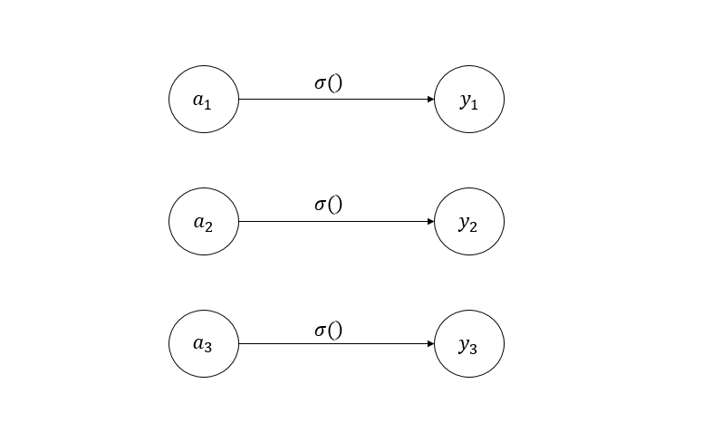
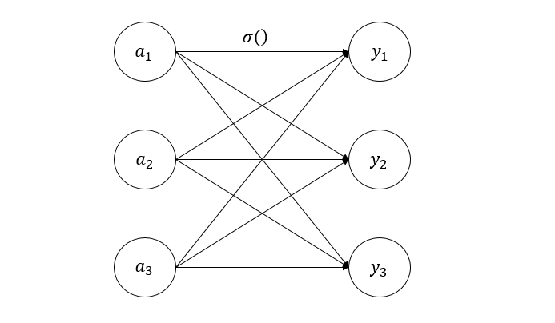
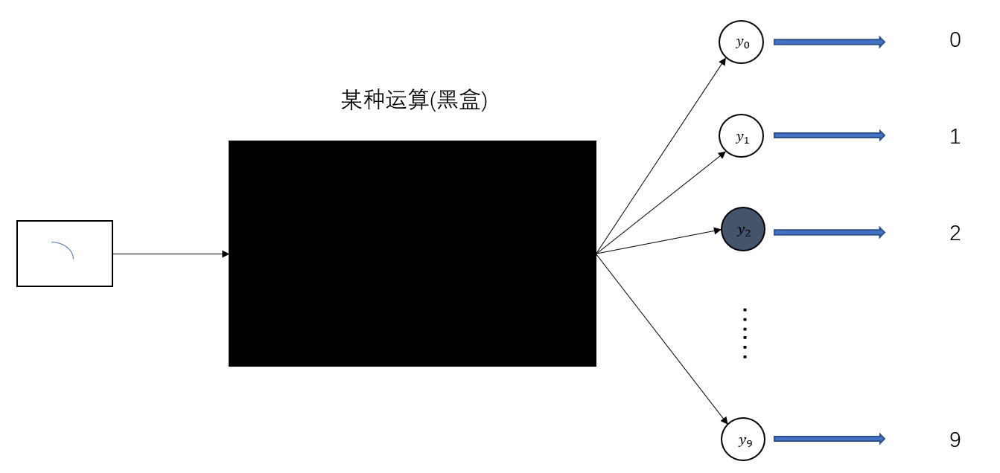

# 输出层的设计
神经网络可以应用于分类和回归问题上，不过需要视情况改变输出层的激活函数。
<br>
一般来说，回归问题用恒等函数，分类问题用softmax函数。

以下一段摘自原文：
<br>
机器学习的问题大致可以分为分类问题和回归问题。分类问题是数据属于哪一个类别的问题。比如，区分图像中的人是男性还是女性的问题就是分类问题。而回归问题是根据某个输入预测一个(连续的)数值的问题。比如，根据一个人的图像预测这个人的体重的问题就是回归问题(类似“57.4kg”这样的预测)。

## 恒等函数和 softmax函数
之前提到过，恒等函数会将输入原样输出，如果使用图表示的话，如下图所示。激活函数可以用一根箭头来表示。


<center>恒等函数</center>

分类问题中使用的 softmax 函数可以使用如下式：
$$
y_{k}=\frac{e^{a_{k}}}{\sum_{i=1}^{n}e^{a_{i}}}
$$
该式子表示假设输出层共有 $n$ 个神经元，计算第 $k$ 个神经元的输出 $y_{k}$。其分子是输入信号 $a_{k}$ 的指数函数，分母是所有输入信号的指数函数的和。可以看出，输出层的各个神经元都受到所有输入信号的影响。

用图表示 softmax 函数的话，如下图所示。
<br>

<center>softmax 函数</center>
<br>

上图中可以看出，softmax 函数的输出通过箭头与所有的输入信号相连。
现在我们来实现这个函数。
```python
import numpy as np

a = np.array([0.3, 2.9, 4.0])
exp_a = np.exp(a)
print(exp_a)
# [ 1.34985881 18.17414537 54.59815003]
sum_exp_a = np.sum(exp_a)
print(sum_exp_a)
# 74.1221542101633
y = exp_a / sum_exp_a
print(y)
# [0.01821127 0.24519181 0.73659691]
```
将其定义为一个函数。
```python
import numpy as np

def softmax(a):
    exp_a = np.exp(a)
    sum_exp_a = np.sum(exp_a)
    y = exp_a / sum_exp_a
    return y
```

## 实现 softmax函数时的注意事项
在学指数时，我们都听说过指数爆炸，softmax 函数在使用时也会发生指数爆炸现象，而计算机存储的数据都是有限的，因此这些超大数进行运算时，结果往往会与预期不一致。

以下一段摘自原文：
<br>
计算机处理“数”时，数值必须在4字节或8字节的有限数据宽度内。这意味着数存在有效位数，也就是说，可以表示的数值范围是有限的。因此，会出现超大值无法表示的问题。这个问题称为溢出，在进行计算机的运算时必须(常常)注意。

我们对 softmax 函数进行改造。
$$
y_{k}=\frac{e^{a_{k}}}{\sum_{i=1}^{n}e^{a_{i}}}=\frac{Ce^{a_{k}}}{C\sum_{i=1}^{n}e^{a_{i}}}
$$
$$
=\frac{e^{(a_{k}+\log C)}}{\sum_{i=1}^{n}e^{(a_{i}+\log C)}}
$$
$$
=\frac{e^{(a_{k}+ C^{\prime})}}{\sum_{i=1}^{n}e^{(a_{i}+C^{\prime})}}
$$

<br>


使用 $C^\prime$ 可以再不改变结果的情况下防止计算过程中的数据溢出。来看一个例子。
```python
import numpy as np

a = np.array([1010, 1000, 990])
print(np.exp(a) / np.sum(np.exp(a)))
# [nan nan nan]
# 为nan(not a number，不确定)
c = np.max(a)
# 对 a 进行处理
a = a-c
print(a)
# [  0 -10 -20]
print(np.exp(a) / np.sum(a))
# [-3.33333333e-02 -1.51333099e-06 -6.87051207e-11]
```
综上，softmax 可以这样实现：
```python
import numpy as np

def softmax(a):
    c = np.max(a)
    exp_a = np.exp(a - c)  
    sum_exp_a = np.sum(exp_a)
    y = exp_a / sum_exp_a
    return y
```

## softmax 函数的特征
从 softmax 函数的表达式：
$$
y_{k}
=\frac{e^{(a_{k}+ C^{\prime})}}{\sum_{i=1}^{n}e^{(a_{i}+C^{\prime})}}
$$

$C^\prime$ 可以为 $max(a_{i})$。
从这个表达式有：
$$
\sum_{i=1}^{|y|}y_{i}=1
$$
其中，$|y|$ 为输出的个数，也就是所有输出的和为 1，每个输出都介于 0-1 之间。将 $R$ 范围内的所有数压缩到 0-1 之间了，而由于指数函数的单调性，输出元素的大小关系不会改变。

一般而言，神经网络只把输出值最大的神经元所对应的类别作为预测结果。并且，即便使用softmax函数，输出值最大的神经元的位置也不会变。因此，神经网络在进行分类时，输出层的 softmax 函数可以省略。在实际的问题中，由于指数函数的运算需要一定的计算机运算量，因此输出层的softmax函数一般会被省略。

以下一段来自于原文：
<br>
求解机器学习问题的步骤可以分为“学习”和“推理”两个阶段。首先，在学习阶段进行模型的学习，然后，在推理阶段，用学到的模型对未知的数据进行推理(分类)。如前所述，推理阶段一般会省略输出层的 softmax 函数。在输出层使用 softmax 函数是因为它和神经网络的学习有关系(详细内容请参考下一章)。

## 输出层的神经元数量

输出层的神经元数量需要根据待解决的问题来决定。对于分类问题，输出层的神经元数量一般设定为类别的数量。若是对单个数字的辨别，可以将输出层神经元的个数设定为 10 个。
一般来说，待分的类别有几个，输出层神经元个数就有几个。
例如在数字识别中，每一个样本被输入层接收，传至隐藏层经过计算后，在输出层会输出属于这 10 个类别的概率，选择最大的类别，就是本次预测的结果。



如上图所示，2 是此处预测的结果。