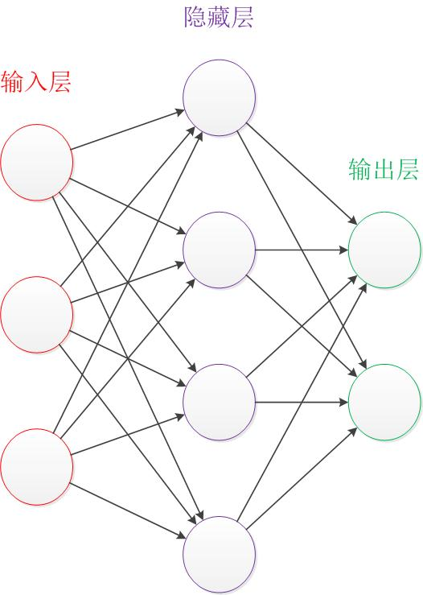
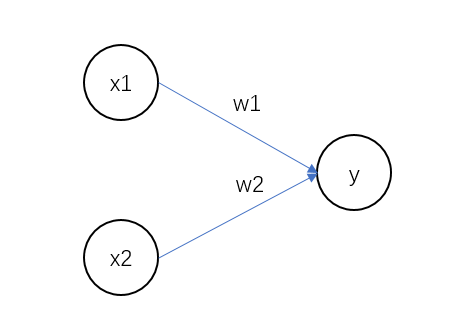
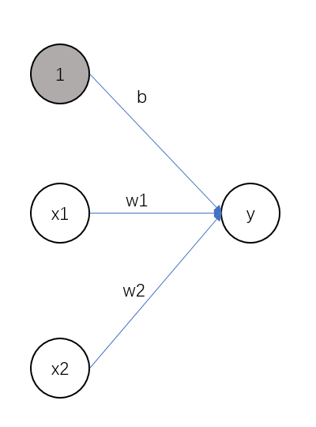
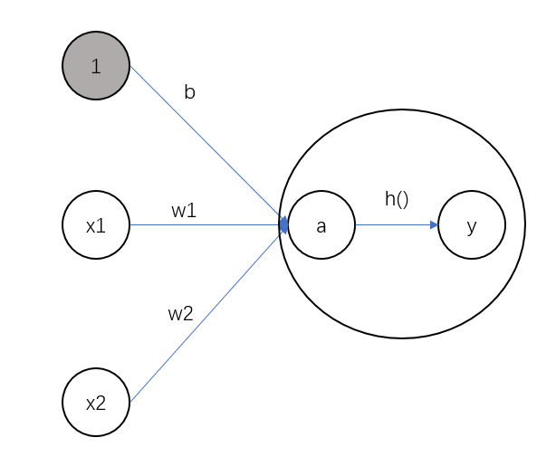
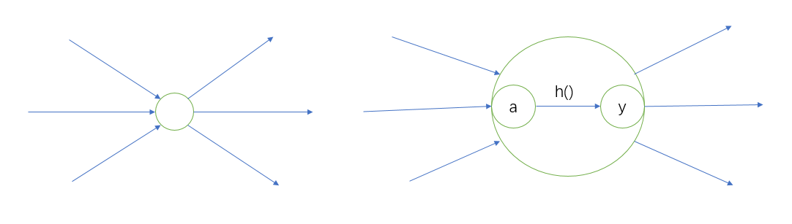

# 从感知机到神经网络

接下来，我们会从感知机出发介绍神经网络的结构。

## 神经网络的例子

这是一个神经网络的图示，图有点大了...
 

神经网络

 
最左边的一列是输入层，中间的一列是隐藏层(中间层)，最右边的一列是输出层。
中间隐藏层的神经元(和输入层，输出层不同)是看不见的，可以把它想象成一个黑盒。

此外，我们通常把输入层到输出层依次称为第 0 层，第 1 层，第 2 层(层号之所以从0开始，是为了方便后面基于 Python 进行实现)。
 

以下一段来自于原书。
 
上图中，第 0 层对应输入层，第 1 层对应隐藏层(中间层)，第2层对应输出层。图中的网络一共由 3 层神经元构成，但实际上只有 2 层神经元有权重，因此将其称为“2层网络”。请注意，有的书也会根据构成网络的层数，把图中的网络称为“3层网络”。本书将根据实质上拥有权重的层数(输入层，隐藏层，输出层的总数减去 1 后的数量)来表示网络的名称。

接下来，我们将介绍神经网络中的信号是如何传递的。

## 复习感知机
回顾之前第二章所学的感知机模型。
 

感知机模型

 

感知机接收两个神经元的输入信号，并乘以对应的权重之和加上偏置后输出 $y$。数学公式如下：

$$
y  =
\begin{cases}
0   & \text{ $b+x_{1}w_{1} + x_{2}w_{2}\leq 0 $} \\
1   & \text{ $b+ x_{1}w_{1} + x_{2}w_{2}>0$ }
\end{cases}
$$

$b$ 是被称为偏置的参数，用于控制神经元被激活的容易程度；而 $w_{1}$ 和 $w_{2}$ 是表示各个信号的权重的参数，用于控制各个信号的重要性。

在上图中，偏置 $b$ 并没有被画出来。如果想表示出 $b$ ，可以像下图所示操作。
 

增加偏置作为神经元

 

我们增加了一个神经元，它的输入信号为 1，权重为 $b$，现在这个感知机将接收$x_{1}$，$x_{2}$，$1$ 三个信号作为神经元的输入，将其与各自的权重相乘后求和 $y$，如果结果大于 0，则输出 1，否则输出 0。另外，由于偏置的输入信号一直是 1，为了区别于其他神经元，在图中把这个神经元整个被涂成灰色。

现在简化上式，用一个函数来表示这种分情况的动作，引入新函数 $h(x)$。
$$
y=h(b+w_{1}x_{1}+w_{2}x_{2})
$$
简化后的式子如下。
$$
h(x)  =
\begin{cases}
0   & \text{ $x\leq 0 $} \\
1   & \text{ $x>0$ }
\end{cases}
$$
$x$ 超过 0 则输出 1，否则输出 0。这就是 $h(x)$ 的作用。

## 激活函数登场

刚刚的 $h(x)$ 函数会将输入信号的总和根据一定的条件输出，这种函数一般称为激活函数(activation function)。

我们进一步改写 $h(x)$，将其分为两个阶段，先计算输入信号的加权和。
$$
a=b+w_{1}x_{1}+w_{2}x_{2}
$$
该式计算输入信号的加权和偏置的总和，结果为 $a$，然后使用激活函数转换，将 $h(x)$ 将 $a$ 转换为 $y$。
$$
y=h(a)
$$

用一张图示意如下：
 

计算过程

 

图中大圈 O 中展现了激活函数的计算过程。将所有输入信号的加权总和汇总到节点 $a$，之和节点 $a$ 被激活函数 $h()$ 转换为节点 $y$。
 
注：节点和神经元的含义相同。

现在我们可以使用一个大圈 O 表示神经元。在本书中，在可以明确神经网络的计算过程的情况下，将在图中明确显示激活函数的计算过程。如下图所示。

神经元计算过程

之后，我们将具体介绍激活函数。激活函数是连接感知机和神经网络的桥梁。

以下一段来自于原文：
 
本书在使用“感知机”一词时，没有严格统一它所指的算法。一般而言，“朴素感知机”是指单层网络，指的是激活函数使用了阶跃函数的模型。“多层感知机”是指神经网络，即使用 sigmoid 函数(后述)等平滑的激活函数的多层网络。