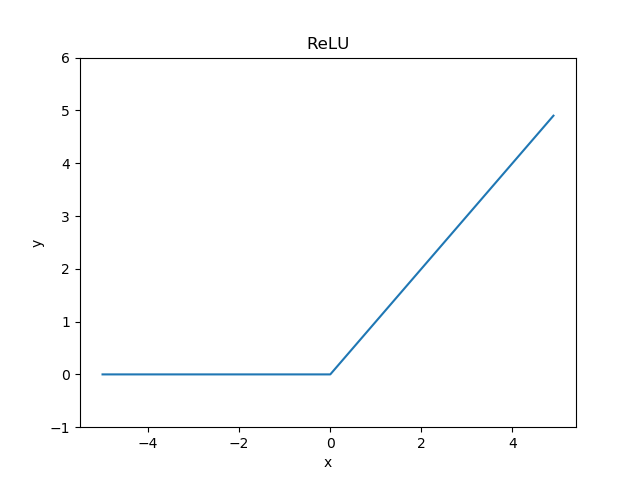

# 激活函数

上节，我们介绍了一个激活函数，它的特征是，一旦输入值超过了阈值，就会输出 1，否则为 0。这样的函数被称为“阶跃函数”。
<br>
在数学中，我们知道有一个概念叫“间断点”，它产生的原因是函数在该点不可导，或者说导数没了，函数“越过了”该点。
<br>
在这个阶跃函数中，我们发现，$h(x)$ 在 $x=0$ 处是不可导的，所以，函数在 $x=0$ 一下子越过去了，也称为“阶跃函数”。

我们的感知机使用了众多激活函数中的阶跃函数，接下来，它将使用其他函数作为激活函数，而这也意味我们慢慢进入了神经网络的世界。

现在，我们将介绍神经网络中常用的激活函数。

## sigmoid 函数

sigmoid 函数是神经网络中很经典的函数，表达式如下：
$$
h(x)=\frac{1}{1+e^{-x}}
$$


实际上，之前介绍的感知机和接下来要介绍的神经网络的主要区别在于这个激活函数。其他方面，诸如神经元的多层连接的构造，信号的传递方法等，基本上和感知机大同小异。
<br>
下面，让我们通过将它和阶跃函数进行比较来详细学习激活函数中的 sigmoid 函数。

## 阶跃函数的实现

我们先简单演示下阶跃函数。
```python
def step_function(x):
    if x > 0:
        return 1
    else:
        return 0
```
可惜这个函数只能接受标量，不能接受数组，我们再对它进行改进。
```python
import numpy as np

def step_function(x):
    y = x > 0
    return y.astype(np.int)


print(step_function(np.array([-1.0, 1.0, 2.0])))
# [0 1 1]
```
看着有些难懂，我们来一步步展示这个过程。
```python
import numpy as np

x = np.array([-1.0, 1.0, 2.0])
print(x)
# [-1.  1.  2.]
y = x > 0
print(y)
# [False  True  True]
y = y.astype(np.int)
print(y)
# [0 1 1]
```
我们对 $x$ 进行比较运算后，会生成一个布尔类型数组，但是呢，我们需要整形的 0/1 输出，将数组 $y$ 内布尔类型元素转为整形即可。

astype() 方法可以将原有数据类型转换为参数指定的数据类型。 


## 阶跃函数的图像
我们来画出阶跃函数的图像。
```python
import numpy as np
import matplotlib.pylab as plt

def step_function(x):
    return np.array(x > 0, dtype=np.int)


x = np.arange(-5.0, 5.0, 0.1)
y = step_function(x)
plt.plot(x, y, label="step_function")
plt.xlabel("x")
plt.ylabel("y")
plt.title("step_function")
plt.ylim(-0.1, 1.1)  # 指定y轴的范围
plt.show()
````
图像如下：
<br>

<center>step_function</center>
<br>

如图，阶跃函数在 $x=0$ 时发生“骤变”，从 0 变为 1，呈阶梯式变化，所以叫阶跃函数。

## sigmoid函数的实现
阶跃函数的实现如下：
```python
import numpy as np

def sigmoid(x):
    return 1 / (1 + np.exp(-x))

print(sigmoid(0))
# 0.5
print(sigmoid(np.array([1.0, 2.0, 3.0])))
# [0.73105858 0.88079708 0.95257413]
```
输入的参数无论是标量还是数组，都是可以计算的。

下面，我们来做出它的图像。
```python
import numpy as np
import matplotlib.pylab as plt

def sigmoid(x):
    return 1 / (1 + np.exp(-x))


x = np.arange(-5.0, 5.0, 0.1)
y = sigmoid(x)
plt.plot(x, y, label="sigmoid")
plt.xlabel("x")
plt.ylabel("y")
plt.title("sigmoid")
# 指定y轴的范围
plt.ylim(-0.1, 1.1)
plt.show()
```
图像如下：
<br>

<center>sigmoid</center>


## sigmoid 函数和阶跃函数的比较

sigmoid 函数是光滑的，即处处可导，而阶跃函数在 $x=0$ 时不可导，$x=0$ 是它的间断点，也就是说 0 的存在使阶跃函数“不光滑了”。

我们将两个函数绘制在一起。
```python
import numpy as np
import matplotlib.pylab as plt

def sigmoid(x):
    return 1 / (1 + np.exp(-x))

def step_function(x):
    return np.array(x > 0, dtype=np.int)


x = np.arange(-5.0, 5.0, 0.1)
y_sigmoid = sigmoid(x)
y_step_function = step_function(x)
plt.plot(x, y_sigmoid, label="sigmoid")
plt.plot(x, y_step_function, linestyle="--", label="step_function")
plt.xlabel("x")
plt.ylabel("y")
plt.title("sigmoid && step_function")
# 指定y轴的范围
plt.ylim(-0.1, 1.1)
plt.show()
```
图像如下：


<center>sigmoid && step_function</center>

sigmoid 和阶跃函数有着相似的地方和不同点。
<br>
相似点它们的定义域为 $R$，值域为$(0,1)$。
<br>
不同点，simgoid 处处可导，且单调递增，阶跃函数就不是了。

在数学里面，我们知道 $e$ 是一个很神奇的常数，指数函数 $(e^{x})^n=e^{x}$，即 $e^{x}$ 或 $e^{-x}$ 有无穷阶导数，其实这在神经网络里面有着重要的作用，这点在之后就会涉及。

## 非线性函数
sigmoid 函数和阶跃函数两个都是非线性函数。

以下一段来自原文:
<br>
在介绍激活函数时，经常会看到“非线性函数”和“线性函数”等术语。
函数本来是输入某个值后会返回一个值的转换器。向这个转换器输入某个值后，输出值是输入值的常数倍的函数称为线性函数(用数学
式表示为 $h(x) = cx$，$c$ 为常数)。因此，线性函数是一条笔直的直线。而非线性函数，顾名思义，指的是不像线性函数那样呈现出一条直线的函数。

神经网络的激活函数必须使用非线性函数，为什么呢？
<br>

其实很简单，考虑一个线性函数 $h(x)=cx$ 作为激活函数时，无论你的网络有多少层，只要是线性变化，$y(x)=h(h(...h(x)))$，总能找到一个线性函数 $h_{0}(x)$，使得 $y(x)=h(h(...h(x)))=h_{0}(x)$，此时层数将毫无意义。
<br>
使用线性函数时，无法发挥多层网络的优势。因此，为了发挥叠加层的优势，激活函数必须使用非线性函数。

## ReLU 函数

ReLU 函数是神经网络中广泛应用的激活函数，它的数学表达式如下：
$$
h(x)=
\begin{cases}
x & \text{$x>0$} \\
0 & \text{$x\leq0$}
\end{cases}
$$
实现也是很简单的。
```python
import numpy as np

def relu(x):
    return np.maximum(0, x)
```
做出它的图像：
```python
import numpy as np
import matplotlib.pylab as plt

def relu(x):
    return np.maximum(0, x)


x = np.arange(-5.0, 5.0, 0.1)
y = relu(x)
plt.plot(x, y, label="ReLU")
plt.xlabel("x")
plt.ylabel("y")
plt.title("ReLU")
plt.ylim(-1, 6)  # 指定y轴的范围
plt.show()
```
如下图：
<br>

<center>ReLU</center>
<br>
本章剩余部分的内容仍将使用 sigmoid 函数作为激活函数，但在之和，我们将主要使用 ReLU 函数。