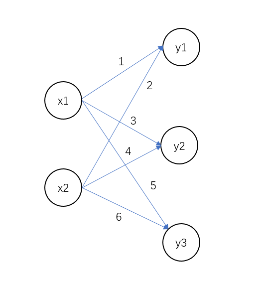

# 多维数组的运算

掌握 numpy 中多维数组的运算，可以使我们高效地实现神经网络。
本小节将介绍多维数组的运算。

## 多维数组
多维数组简单来说就是有多个维度，之前我们用的都是一维数组。
<br> 
不妨从一维数组说起吧。
```python
import numpy as np

A = np.array([1, 2, 3, 4])
print(A)
# [1 2 3 4]
print(np.ndim(A))
# 1
print(A.shape)
# (4,)
print(A.shape[0])
# 4
```
np.dim() 函数返回数组的维度；shape 返回数组形状，是个元组(tuple)；shape[0] 返回元组的第一个元素。

下面我们来看看二维数组。
```python
import numpy as np

A = np.array([[1, 2], [3, 4], [5, 6]])
print(A)
"""
[[1 2]
 [3 4]
 [5 6]]
"""
print(np.ndim(A))
# 2
print(A.shape)
# (3, 2)
```
这里生成了一个 3 x 2 的数组，可以说是矩阵，A 是个 3 行，2 列的矩阵。行和列的索引都从 0 开始。
<br>
注：大部分的语言对于数组的索引都是从 0 开始的，但也有例外， matlab 就不是。

## 矩阵乘法

矩阵在线性代数中是很重要的部分。
<br>
先给出矩阵(乘法)点乘定义：
<br>
设 $A$ 为 $m \times p$ 的矩阵，$B$ 为 $p \times n$ 的矩阵，则称 $m \times n$ 的矩阵 $C$ 为矩阵 $A$ 与矩阵 $B$ 的乘积，记 $C=AB$，那么矩阵 $C$ 中第 $i$ 行第 $j$ 列的元素可以表示为：
$$
C_{i,j}=(AB)_{i,j}=\sum_{k=1}^{p}a_{ik}b_{kj}=a_{i1}b_{1j}+a_{i2}b_{2j}+...+a_{ip}b_{pj}
$$

下面用 Python 来实现矩阵相乘。
```python
import numpy as np

A = np.array([[1, 2, 3], [4, 5, 6]])
print(A.shape)
# (2, 3)
B = np.array([[1, 2], [3, 4], [5, 6]])
print(B.shape)
# (3, 2)
print(np.dot(A, B))
"""
[[22 28]
 [49 64]]
"""
```
np.dot() 是计算两个数组的(乘积)点乘，并返回结果数组。
只要是满足矩阵相乘条件的矩阵都可以相乘。
$$
A_{m \times p}\times B_{p \times n}=C_{m \times n}
$$
如果不满足，就会有以下错误。
```python
import numpy as np

A = np.array([[1, 2, 3], [4, 5, 6]])
print(A.shape)
# (2, 3)
B = np.array([[1, 2], [3, 4]])
print(B.shape)
# (2, 2)
print(np.dot(A, B))
"""
Traceback (most recent call last):
  File "e:\codes\2\test1.py", line 9, in <module>
    print(np.dot(A, B))
ValueError: shapes (2,3) and (2,2) not aligned: 3 (dim 1) != 2 (dim 0)
"""
```
A 和 B 不满足矩阵相乘的条件。
<br>

上式只是矩阵的表示形式，能写成上式形式的，就可以相乘，不论是一维还是二维数组。
```python
import numpy as np

A = np.array([[1, 2], [3, 4], [5, 6]])
print(A.shape)
# (2, 3)
B = np.array([7, 8])
print(B.shape)
# (2,)
print(np.dot(A, B))
"""
[23 53 83]
"""
```
满足条件的矩阵就可以相乘。

## 神经网络的内积
我们以单层神经网络为对象，使用 numpy 来实现它，这里的神经网络省略了偏置和激活函数，只有权重。
如图：
<br>


我们要实现的操作是：
$$
X_{1 \times 2} \times W_{2 \times 3}=Y_{1 \times 3}
$$
代码如下：

```python
import numpy as np


X = np.array([1, 2])
print(X.shape)
# (2,)
W = np.array([[1, 3, 5], [2, 4, 6]])
print(W.shape)
# (2, 3)
Y = np.dot(X, W)
print(Y)
# [ 5 11 17]
```

如果我们自己手动实现矩阵相乘，它的速度会比 np.dot() 要慢，多造轮子总是好的，但使用时还是尽可能用官方的函数。
