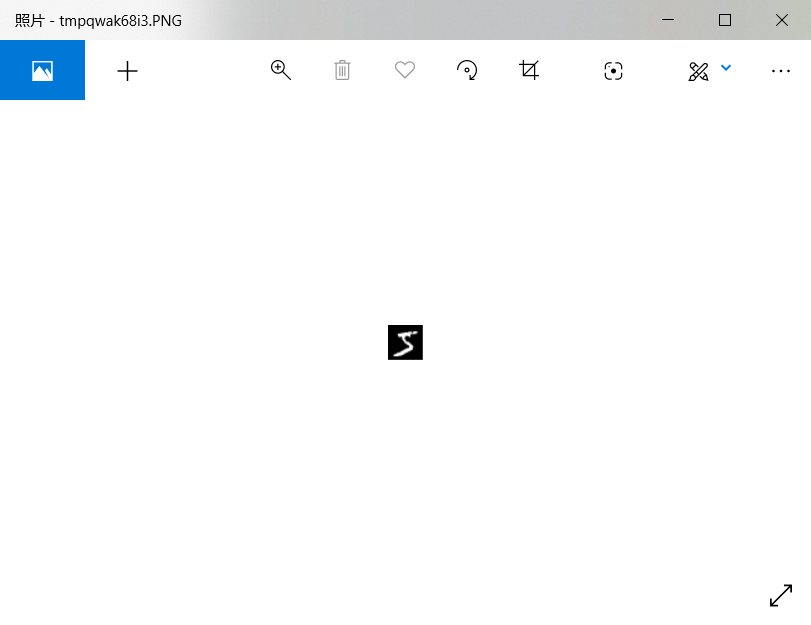
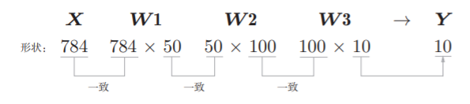
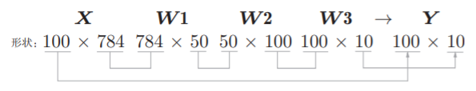

# 手写数字识别
在介绍完神经网络的结构后，我们来进行手写数字图像的分类。

以下一段关于机器学习过程的描述来自原书：
<br>
和求解机器学习问题的步骤(分成学习和推理两个阶段进行)一样，使用神经网络解决问题时，也需要首先使用训练数据(学习数据)进行权重参数的学习；进行推理时，使用刚才学习到的参数，对输入数据进行分类。


注：此处实验的方法和原书略有不同。

## MNIST数据集
注：对数据集的说明来自于原文：
<br>
这里使用的是MNIST手写数字图像集。MNIST是机器学习领域最有名的数据集之一，被应用于从简单的实验到发表的论文研究等各种场合。实际上，在阅读图像识别或机器学习的论文时，MNIST数据集经常作为实验用的数据出现。
<br>
MNIST数据集是由0到9的数字图像构成的。训练图像有6万张，测试图像有1万张，这些图像可以用于学习和推理。MNIST数据集的一般使用方法是，先用训练图像进行学习，再用学习到的模型度量能在多大程度上对测试图像进行正确的分类。
<br>
MNIST的图像数据是28像素 × 28像素的灰度图像（1通道），各个像素
的取值在0到255之间。每个图像数据都相应地标有“7”“2”“1”等标签。


<center>MNIST图像数据集</center>
<br>

原书提供了下载 MNIST 数据集的脚本 ```mnist.py```。使
用 ```mnist.py``` 中的 load_mnist() 函数，就可以按下述方式读入MNIST数据。

在这里，我将 ```mnist.py``` 放在了当前工作目录下。
<br>
加载数据集(```test.py```)：
```python
import os
import sys
from mnist import load_mnist

# 第一次调用会花费几分钟
(x_train, t_train), (x_test, t_test) = load_mnist(flatten=True,
                                                  normalize=False)
print(x_train.shape)  
# (60000, 784)
print(t_train.shape)  
# (60000,)
print(x_test.shape)  
# (10000, 784)
print(t_test.shape)  
# (10000,)
```
此时，第一次调用 load_mnist 函数会下载相应的文件，下载到本地后，之后只需读入本地文件即可。

实际实验时，由于网络等原因数据集以及其他文件下载速度缓慢，这里我是提前将相关文件下载好后，放在当前工作目录下，现在工作目录的结构如下：


两个文件夹是 vscodes 生成的，```mnist.py``` 是该书给出的脚本，下载即可使用，```test.py``` 是当前测试用的文件，而其他文件是我们此次实验所需的，可以提前下载好并导入，这样可以节省因网络问题造成不必要的下载时间的消耗。

以下内容来自于原书，对实验脚本的一个说明：
<br>
load_mnist函数以“(训练图像，训练标签)，(测试图像，测试标签 )”的形式返回读入的MNIST数据。
<br>

此外，还可以像load_mnist(normalize=True,flatten=True, one_hot_label=False)这样，设置3个参数。第1个参数normalize设置是否将输入图像正规化为 0.0～1.0 的值。如果将该参数设置为=False，则输入图像的像素会保持原来的 0～255。第2个参数flatten设置是否展开输入图像(变成一维数组)。如果将该参数设置为False，则输入图像为1 × 28 × 28的三维数组；若设置为True，则输入图像会保存为由784个元素构成的一维数组。第3个参数one_hot_label设置是否将标签保存为onehot表示(one-hot representation)。one-hot表示是仅正确解标签为1，其余皆为0的数组，就像 [0,0,1,0,0,0,0,0,0,0] 这样。当one_hot_label为False时，只是像7，2这样简单保存正确解标签；当one_hot_label为True时，标签则保存为one-hot表示。
<br>

Python有pickle这个便利的功能。这个功能可以将程序运行中的对象保存为文件。如果加载保存过的pickle文件，可以立刻复原之前程序运行中的对象。用于读入MNIST数据集的load_mnist()函数内部也使用了pickle功能(在第2次及以后读入时)。利用pickle功能，可以高效地完成MNIST数据的准备工作。


我们可以使用PIL(Python Image Library)模块，显示图片(```mnist_show.py```)。
```python
# coding: utf-8
import sys
import os
import numpy as np
from mnist import load_mnist
from PIL import Image

def img_show(img):
    pil_img = Image.fromarray(np.uint8(img))
    pil_img.show()


(x_train, t_train), (x_test, t_test) = load_mnist(flatten=True, normalize=False)

img = x_train[0]
label = t_train[0]
print(label)  
# 5

print(img.shape)  
# (784,)
img = img.reshape(28, 28)  
# 把图像的形状变为原来的尺寸
print(img.shape)  
# (28, 28)

img_show(img)
```

这里需要注意的是，flatten=True时读入的图像是以一列(一维)NumPy数组的形式保存的。因此，显示图像时，需要把它变为原来的 28像素×28像素 的形状。可以通过reshape()方法的参数指定期望的形状，更改NumPy数组的形状。此外，还需要把保存为NumPy数组的图像数据转换为PIL用的数据对象，这个转换处理由Image.fromarray()来完成。

图像如下：


<center>显示MNIST图像</center>

## 神经网络的推理处理

下面，我们对这个MNIST数据集实现神经网络的推理处理。神经网络的输入层有784个神经元，输出层有10个神经元。输入层的784这个数字来源于图像大小的28 × 28 = 784，输出层的10这个数字来源于10类别分类(数字0到9，共10类别)。

此外，这个神经网络有2个隐藏层，第1个隐藏层有50个神经元，第2个隐藏层有100个神经元。这个50和100可以设置为任何值。


下面我们先定义get_data()，init_network()，predict()这3个函数(位于 ```neuralnet_mnist.py```)，在这个程序中，```functions.py``` 包含了我们之前用到的一些函数，这里我将它放在当前工作目录下，同时init_network()会读入保存在pickle文件sample_weight.pkl中的学习到的权重参数。这个文件中以字典变量的形式保存了权重和偏置参数。它也位于当前工作目录下。
```python
# coding: utf-8
import sys
import os
import numpy as np
import pickle
from mnist import load_mnist
from functions import sigmoid, softmax


def get_data():
    (x_train, t_train), (x_test, t_test) = load_mnist(
        normalize=True, flatten=True, one_hot_label=False)
    return x_test, t_test


def init_network():
    with open("sample_weight.pkl", 'rb') as f:
        network = pickle.load(f)
    return network


def predict(network, x):
    W1, W2, W3 = network['W1'], network['W2'], network['W3']
    b1, b2, b3 = network['b1'], network['b2'], network['b3']

    a1 = np.dot(x, W1) + b1
    z1 = sigmoid(a1)
    a2 = np.dot(z1, W2) + b2
    z2 = sigmoid(a2)
    a3 = np.dot(z2, W3) + b3
    y = softmax(a3)

    return y


x, t = get_data()
network = init_network()
accuracy_cnt = 0
for i in range(len(x)):
    y = predict(network, x[i])
    p = np.argmax(y)  # 获取概率最高的元素的索引
    if p == t[i]:
        accuracy_cnt += 1

print("Accuracy:" + str(float(accuracy_cnt) / len(x)))
# Accuracy:0.9352
```

以下是原文对于实验的部分说明：
<br>
首先获得MNIST数据集，生成网络。接着，用for语句逐一取出保存在x中的图像数据，用predict()函数进行分类。predict()函数以NumPy数组的形式输出各个标签对应的概率。比如输出[0.1, 0.3, 0.2, ..., 0.04]的数组，该数组表示“0”的概率为0.1，“1”的概率为0.3，等等。然后，我们取出这个概率列表中的最大值的索引(第几个元素的概率最高)，作为预测结果。可以用np.argmax(x)函数取出数组中的最大值的索引，np.argmax(x)将获取被赋给参数x的数组中的最大值元素的索引。最后，比较神经网络所预测的答案和正确解标签，将回答正确的概率作为识别精度。


执行上面的代码后，会显示“Accuracy:0.9352”。这表示有93.52%的数据被正确分类了。目前我们的目标是运行学习到的神经网络，所以不讨论识别精度本身，不过以后我们会花精力在神经网络的结构和学习方法上，思考如何进一步提高这个精度。实际上，我们打算把精度提高到99%以上。另外，在这个例子中，我们把load_mnist函数的参数normalize设置成了True。将normalize设置成True后，函数内部会进行转换，将图像的各个像素值除以255，使得数据的值在0.0～1.0的范围内。像这样把数据限定到某个范围内的处理称为正规化(normalization)。此外，对神经网络的输入数据进行某种既定的转换称为预处理(pre-processing)。这里，作为对输入图像的一种预处理，我们进行了正规化。

预处理在神经网络(深度学习)中非常实用，其有效性已在提高识别性能和学习的效率等众多实验中得到证明。在刚才的例子中，作为一种预处理，我们将各个像素值除以255，进行了简单的正规化。实际上，很多预处理都会考虑到数据的整体分布。比如，利用数据整体的均值或标准差，移动数据，使数据整体以0为中心分布，或者进行正规化，把数据的延展控制在一定范围内。除此之外，还有将数据整体的分布形状均匀化的方法，即数据白化(whitening)等。

## 批处理
以上就是处理MNIST数据集的神经网络的实现，现在我们来关注输入数据和权重参数的“形状”。再看一下刚才的代码实现。可以运行在 ```neuralnet_mnist.py```上
```python
x, _ = get_data()
network = init_network()
W1, W2, W3 = network['W1'], network['W2'], network['W3']
print(x.shape)
# (10000, 784)
print(x[0].shape)
# (784,)
print(W1.shape)
# (784, 50)
print(W2.shape)
# (50, 100)
print(W3.shape)
# (100, 10)
```
过程中，数组在神经网络中的变换如下：



如果我们考虑有100个样本，那么：



这种打包式的输入数据称为批(batch)。批有“捆”的意思，图像就如同纸币一样扎成一捆。

来自原文对批处理的注解：
<br>
批处理对计算机的运算大有利处，可以大幅缩短每张图像的处理时间。那么为什么批处理可以缩短处理时间呢？这是因为大多数处理数值计算的库都进行了能够高效处理大型数组运算的最优化。并且，在神经网络的运算中，当数据传送成为瓶颈时，批处理可以减轻数据总线的负荷(严格地讲，相对于数据读入，可以将更多的时间用在计算上)。也就是说，批处理一次性计算大型数组要比分开逐步计算各个小型数组速度更快。

下面我们进行批处理实现(```neuralnet_mnist_batch.py```)。
```python
# coding: utf-8
import sys
import os
import numpy as np
import pickle
from mnist import load_mnist
from functions import sigmoid, softmax


def get_data():
    (x_train, t_train), (x_test, t_test) = load_mnist(
        normalize=True, flatten=True, one_hot_label=False)
    return x_test, t_test


def init_network():
    with open("sample_weight.pkl", 'rb') as f:
        network = pickle.load(f)
    return network


def predict(network, x):
    w1, w2, w3 = network['W1'], network['W2'], network['W3']
    b1, b2, b3 = network['b1'], network['b2'], network['b3']

    a1 = np.dot(x, w1) + b1
    z1 = sigmoid(a1)
    a2 = np.dot(z1, w2) + b2
    z2 = sigmoid(a2)
    a3 = np.dot(z2, w3) + b3
    y = softmax(a3)

    return y

# 批处理
x, t = get_data()
network = init_network()

batch_size = 100  # 批数量
accuracy_cnt = 0

for i in range(0, len(x), batch_size):
    x_batch = x[i:i+batch_size]
    y_batch = predict(network, x_batch)
    p = np.argmax(y_batch, axis=1)
    accuracy_cnt += np.sum(p == t[i:i+batch_size])

print("Accuracy:" + str(float(accuracy_cnt) / len(x)))
# Accuracy:0.9352
```

批处理结果和之前的一样。

至此，基于批处理的代码实现就介绍完了。下一章介绍神经网络的学习时，我们将把图像数据作为打包的批数据进行学习，届时也将进行和这里的批处理一样的代码实现。

本节所有的源程序位于 demo/Chapter3_demo 文件夹中。
